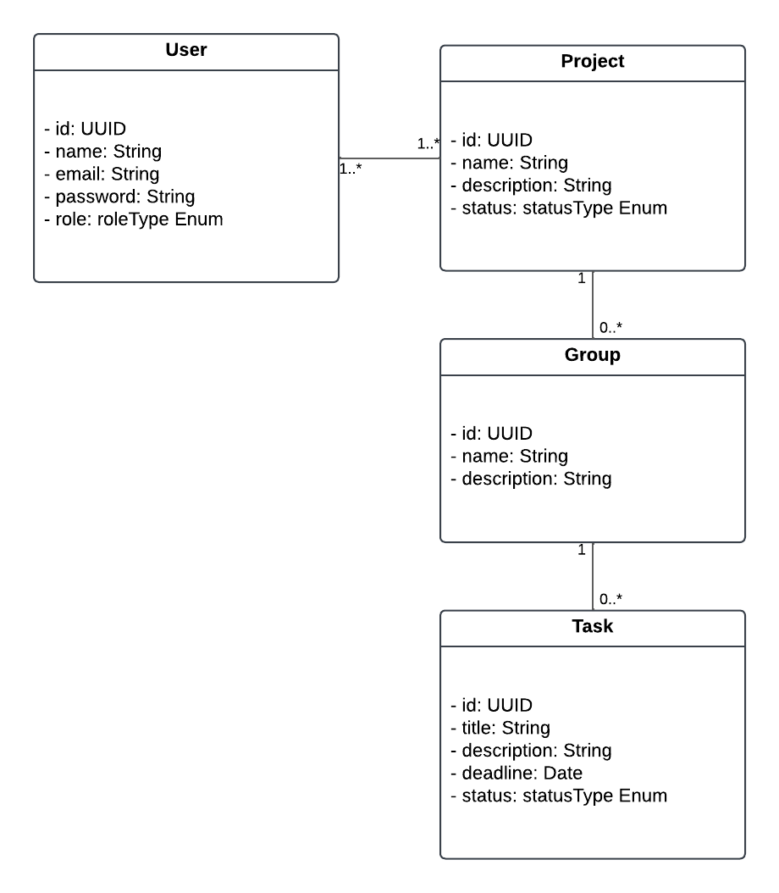

# Backend structure

## Principais Classes:

**User**
- id: UUID
- name: String
- email: String
- password: String
- role: Enum (Admin, Member)
- Relacionamento: 1..* com Project.

**Project**
- id: UUID
- name: String
- description: String
- status: Enum (Active, Completed, Pending)
- Relacionamento: 1..* com Group.

**Group**
- id: UUID
- name: String
- description: String
- Relacionamento: 1..* com Task.

**Task**
- id: UUID
- title: String
- description: String
- deadline: Date
- status: Enum (Todo, In Progress, Done)
- Relacionamento: 1 com User (atribuição).

## Diagrama de Classe



## Code SQL
```SQL
-- Criação da tabela User
CREATE TABLE "User" (
    id UUID PRIMARY KEY,
    name VARCHAR(255) NOT NULL,
    email VARCHAR(255) UNIQUE NOT NULL,
    password VARCHAR(255) NOT NULL,
    role user_role NOT NULL  -- Usando o tipo ENUM já criado
);


-- Criação da tabela Project
CREATE TABLE "Project" (
    id UUID PRIMARY KEY,
    name VARCHAR(255) NOT NULL,
    description TEXT,
    code VARCHAR(50) UNIQUE NOT NULL,
    status project_status NOT NULL  -- Usando o tipo ENUM já criado
);


-- Criação da tabela Group
CREATE TABLE "Group" (
    id UUID PRIMARY KEY,
    name VARCHAR(255) NOT NULL,
    description TEXT,
    idProject UUID NOT NULL,
    FOREIGN KEY (idProject) REFERENCES "Project" (id) ON DELETE CASCADE
);


-- Criação da tabela Task
CREATE TABLE "Task" (
    id UUID PRIMARY KEY,
    title VARCHAR(255) NOT NULL,
    description TEXT,
    deadline DATE,
    idGroup UUID NOT NULL,
    status task_status NOT NULL,  -- Usando o tipo ENUM já criado
    assignedUser UUID,
    FOREIGN KEY (idGroup) REFERENCES "Group" (id) ON DELETE CASCADE,
    FOREIGN KEY (assignedUser) REFERENCES "User" (id) ON DELETE SET NULL
);

```
